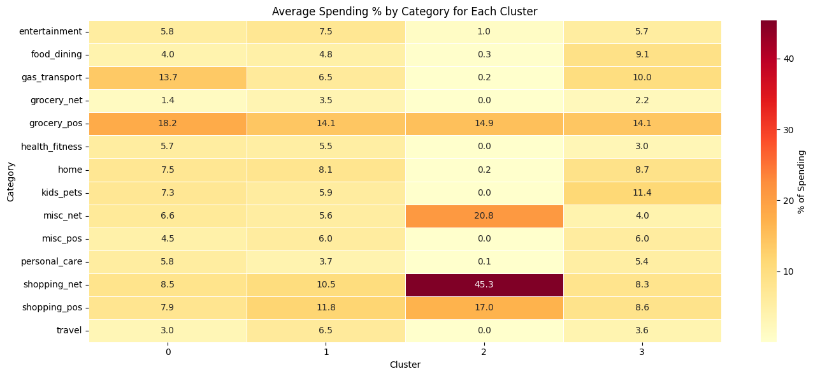
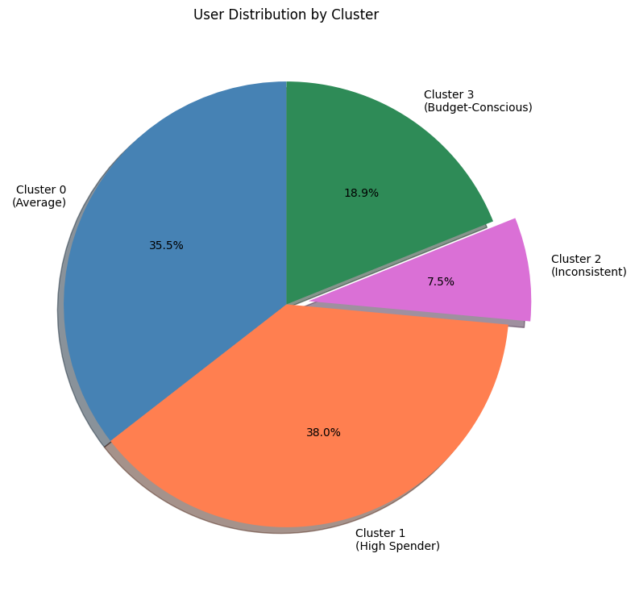
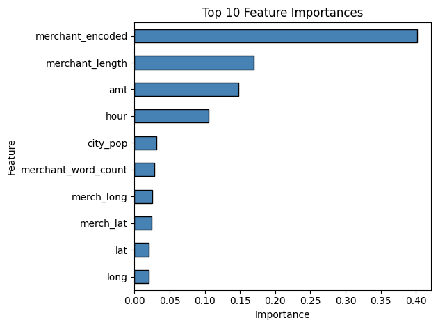
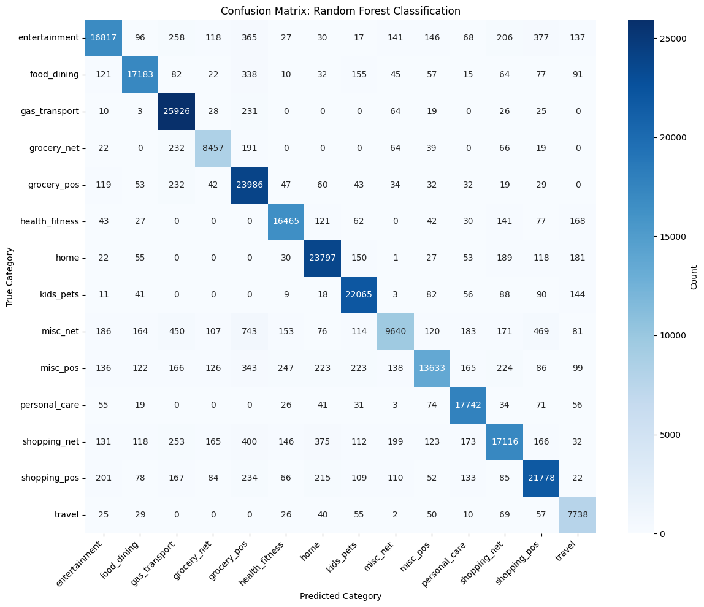
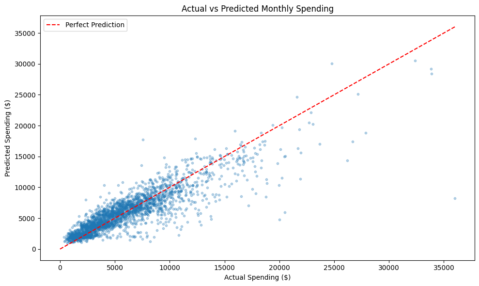

# Smart Personal Finance Advisor

> **CS 5100: Foundations of Artificial Intelligence**  
> Northeastern University

An AI-powered personal finance system that analyzes spending patterns, detects anomalies, predicts future spending, and provides personalized budget recommendations.

---

## Team Members

| Name | NUID |
|------|------|
| Rahul Gudivada | 002560822 |
| Elenta Suzan Jacob | 002530281 |
| Shawn Godfrey Thomas Sahaya Cruz | 002545355 |

---

## Project Overview

This project builds a comprehensive personal finance advisor using multiple ML models:

| Model | Purpose | Status |
|-------|---------|--------|
| Data Exploration | Understand spending patterns | Complete |
| K-Means Clustering | Segment users into types | Complete |
| Random Forest | Categorize transactions | Complete |
| Isolation Forest | Detect fraud/anomalies | Complete |
| Gradient Boosting | Predict future spending | Complete |
| Neural Network | Prioritize budget advice | In Progress |
| SLSQP Optimization | Calculate optimal budgets | In Progress |

---

## 1. Data Exploration & Preprocessing

**Notebook:** `Data_Exploration.ipynb`

### Key Findings

#### Fraud vs Normal Transactions
| Metric | Normal | Fraud |
|--------|--------|-------|
| Average Amount | $68 | $531 |
| Peak Hours | All day | 22:00 - 23:00 |

#### Fraud Rate by Category
| Category | Fraud Rate |
|----------|------------|
| shopping_net | 1.75% |
| misc_net | 1.45% |
| grocery_pos | 1.40% |

#### Fraud Rate by Hour
- **Highest:** Hours 22-23 (~3% fraud rate)
- **Lowest:** Hours 4-21 (~0.1% fraud rate)

### Engineered Features
| Feature | Description |
|---------|-------------|
| `hour` | Hour of transaction (0-23) |
| `day_of_week` | Day (0=Mon, 6=Sun) |
| `month` | Month number |
| `is_weekend` | 1 if Saturday/Sunday |
| `time_of_day` | Morning/Afternoon/Evening/Night |
| `amt_bin` | Amount buckets ($0-50, $50-100, etc.) |

---

## 2. K-Means Clustering (User Segmentation)

**Notebook:** `K_Means_Clustering.ipynb`

### Purpose
Segment users into distinct behavioral groups to enable personalized financial advice.

### Methodology
- Features: Spending percentage across 14 categories
- Scaling: StandardScaler (mean=0, std=1)
- K=4 clusters (design decision for actionable user types)

### Results: 4 User Types

| Cluster | Name | Users | % | Characteristics |
|---------|------|-------|---|-----------------|
| 0 | Average | 349 | 35.5% | Grocery (18.2%) & gas (13.7%) focused |
| 1 | High Spender | 374 | 38.0% | Highest total spent ($123,911), balanced categories |
| 2 | Inconsistent | 74 | 7.5% | Few transactions (10), high avg ($602), online shopping (45%) |
| 3 | Budget-Conscious | 186 | 18.9% | Lower spending ($68,535), family focused |

### Cluster Statistics
| Cluster | Total Spent | Avg Transaction | Num Transactions | Std Dev |
|---------|-------------|-----------------|------------------|---------|
| 0 (Average) | $90,806 | $61.97 | 1,496 | $137.91 |
| 1 (High Spender) | $123,911 | $80.19 | 1,576 | $140.69 |
| 2 (Inconsistent) | $5,960 | $602.11 | 10 | $381.30 |
| 3 (Budget-Conscious) | $68,535 | $69.54 | 991 | $147.54 |

### Visualizations

#### Spending Heatmap by Cluster


- **Cluster 2 (Inconsistent):** Dominated by online shopping (shopping_net 45.3%, misc_net 20.8%)
- **Cluster 0 (Average):** Essentials focused (grocery_pos 18.2%, gas_transport 13.7%)
- **Cluster 1 (High Spender):** Most balanced spending across all categories
- **Cluster 3 (Budget-Conscious):** Family focused (grocery, kids_pets, gas)

#### User Distribution


- 73.5% of users are Average or High Spender (predictable patterns)
- 7.5% are Inconsistent (outliers requiring special attention)

---

## 3. Random Forest (Transaction Categorization)

**Notebook:** `Random_Forest.ipynb`

### Purpose
Automatically categorize transactions into one of 14 spending categories.

### Methodology
- Algorithm: Random Forest Classifier
- Trees: 100
- Max Depth: 20
- Train/Test Split: 80/20

### Results

| Metric | Value |
|--------|-------|
| **Accuracy** | **93.45%** |
| Training Samples | 1,037,340 |
| Test Samples | 259,335 |

### Feature Importance

| Rank | Feature | Importance |
|------|---------|------------|
| 1 | merchant_encoded | 40.13% |
| 2 | merchant_length | 16.97% |
| 3 | amt | 14.81% |
| 4 | hour | 7.2% |
| 5 | day_of_week | 5.8% |



**Key Insight:** Merchant name alone provides ~60-70% of prediction power. Time features contribute less since categories don't vary much by time.

### Confusion Matrix


### Sample Predictions
```
 Transaction: $5.36 at 1:00   → True: misc_net      | Predicted: misc_net
 Transaction: $86.22 at 23:00 → True: personal_care | Predicted: personal_care
 Transaction: $4.73 at 13:00  → True: health_fitness| Predicted: health_fitness
 Transaction: $7.98 at 12:00  → True: kids_pets     | Predicted: kids_pets
 Transaction: $5.00 at 10:00  → True: shopping_pos  | Predicted: shopping_pos
```

---

## 4. Isolation Forest (Anomaly Detection)

**Notebook:** `Isolation_Forest.ipynb`

### Purpose
Detect unusual transactions for fraud alerts and spending warnings.

### Why Isolation Forest?
- **Unsupervised:** Doesn't need fraud labels to learn
- **Handles Imbalance:** Designed for rare events (0.58% fraud)
- **Scalable:** Efficient on 1.3M transactions
- **Detects Novel Patterns:** Can catch new fraud types not in training data

### Methodology
- Algorithm: Isolation Forest
- Contamination: 3% (tuned from 0.58%)
- Features: `amt`, `hour`, `day_of_week`, `category_encoded`, `is_weekend`, `is_high_amount`, `is_night`

### Results

| Metric | Value |
|--------|-------|
| **Fraud Detection Rate** | **73.66%** |
| **False Alarm Rate** | **2.59%** |
| Frauds Caught | 5,529 / 7,506 |
| True Negatives | 1,255,798 |

### Confusion Matrix
```
                 Predicted
                 Normal    Anomaly
Actual Normal    1,255,798   33,371
Actual Fraud        1,977    5,529
```

### Contamination Rate Analysis

| Contamination | Detection Rate | False Alarm Rate | Trade-off |
|---------------|----------------|------------------|-----------|
| 0.58% | 37% | 0.37% | Too conservative |
| 1% | 51% | 0.71% | Better |
| 2% | 70% | 1.61% | Good |
| **3%** | **74%** | **2.59%** | **Selected** |
| 5% | 76% | 4.59% | Too many false alarms |

### Use Cases
| Feature | How It Helps |
|---------|--------------|
| Fraud alerts | "This transaction looks suspicious" |
| Spending alerts | "You usually don't spend this much on shopping" |
| Budget warnings | "Unusual spending detected — you may exceed budget" |

---

## 5. Gradient Boosting (Spending Prediction)

**Notebook:** `Gradient_Boosting.ipynb`

### Purpose
Predict how much a user will spend next month based on their historical patterns.

### Methodology
- Algorithm: Gradient Boosting Regressor
- Parameters: n_estimators=200, learning_rate=0.05, max_depth=5
- Train/Test Split: 80/20

### Feature Engineering

#### Basic Features (10)
`total_spent`, `avg_transaction`, `num_transactions`, `std_transaction`, `max_transaction`, `min_transaction`, `unique_categories`, `age`, `gender`, `weekend_pct`

#### Category Breakdown (14)
Spending amount in each of the 14 categories

#### Lag Features (9) - KEY IMPROVEMENT
| Feature | Description |
|---------|-------------|
| `prev_total_spent` | Last month's spending |
| `prev_2_total_spent` | 2 months ago spending |
| `prev_3_total_spent` | 3 months ago spending |
| `rolling_2m_avg` | Average of last 2 months |
| `rolling_3m_avg` | Average of last 3 months |
| `spending_change` | $ change from last month |
| `spending_change_pct` | % change from last month |
| `month_num` | Month number (seasonality) |

**Total Features: 33**

### Results

| Metric | Training | Test |
|--------|----------|------|
| **R²** | 0.8467 | **0.7706** |
| **MAE** | $1,116 | **$1,295** |
| RMSE | - | $1,987 |

### Model Improvement Journey
| Version | R² | MAE | What Changed |
|---------|-----|-----|--------------|
| Original | 0.52 | $1,877 | Basic features only |
| + Lag Features | 0.58 | $1,737 | Added previous month |
| + Tuned Params | 0.58 | $1,724 | Optimized hyperparameters |
| **+ Enhanced Features** | **0.77** | **$1,295** | Added rolling averages, 3 months history |

**Key Insight:** Lag features improved R² by 25%! Knowing previous months' spending is crucial for prediction.

### Visualizations

#### Actual vs Predicted


- Points cluster around the perfect prediction line
- Strong performance for $0 - $15,000 (where most users fall)
- More scatter at $20,000+ (fewer data points)

### Interpretation
- **R² = 0.77:** Model explains 77% of spending variation
- **MAE = $1,295:** If user spends $5,000/month, prediction is off by ~26%
- **For spending prediction, this is very good!** (typical range: 0.40-0.65)

---

## Next Steps

| Task | Description | Timeline |
|------|-------------|----------|
| Neural Network | Advice prioritization - recommend budget cuts | Week 1 |
| SLSQP Optimization | Calculate optimal budget allocation | Week 2 |
| Streamlit Dashboard | User-friendly web interface | Week 3 |
| Testing & Documentation | Final paper | Week 4 |

---

## Technologies Used

- **Python 3.x**
- **pandas, numpy** - Data manipulation
- **scikit-learn** - ML models
- **matplotlib, seaborn** - Visualizations
- **joblib** - Model persistence
- **Google Colab** - Development environment

